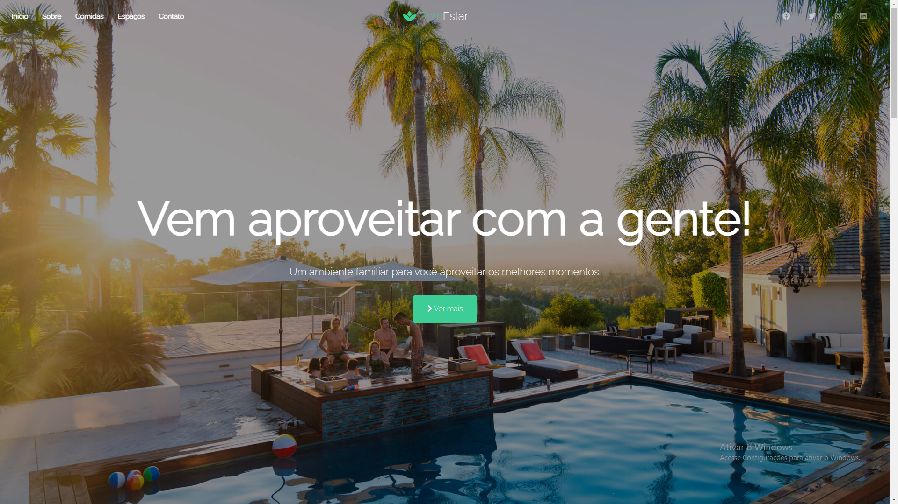

<h2 align="center">Espaço Bem-Estar</h2>

#### Design de frontend do Espaço Bem-Estar feito completamente com:

* HTML & CSS
* Jquery library
* JavaScript lightbox

Créditos: Eric Galvão.

  
Visite o stie aqui: 👉 <a href="#">Link</a>

<!-- prettier-ignore-start -->
<!-- markdownlint-disable -->
<table>
<tr>
<<<<<<< HEAD
<<<<<<< HEAD
<td align="center"><a href="https://github.com/EricAG09"> <b>Eric Galvão</b></a> </td>
=======

<td align="center"><a href="https://github.com/EricAG09"> <b>Eric Galvão</b></a> </td>
>>>>>>> 3e86292899559e856316a18300e9796f6d393127
</tr>
</table>

<!-- markdownlint-enable -->
<!-- prettier-ignore-end -->
